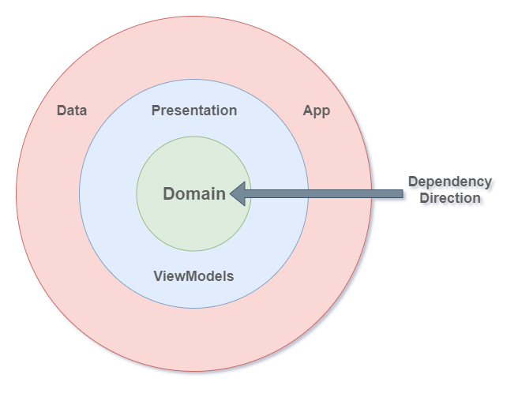

# Teya take home assignment

Take home assignment for Teya's Mobile Engineer interview. Submitted by Allan Yoshio Hasegawa.

The main features of the app:

1. Show a list of albums from the iTunes store
2. Navigate to a specific album to see more details

## Running

To run the app simply open it on AndroidStudio and run the app module. The project was tested with
Android Studio Narwhal | 2025.1.1.

## Unit tests

The entire architecture is built to be easily testable. The following tests showcase different styles of tests and how easy it's to test:

* `FeedResponseSerializerTest` showcasing a simple serializer. Also I used TDD for this one.
* `AlbumDetailsViewModelTest` showcasing a ViewModel test with Flow/Coroutines.
* `IntegrationTest` showcasing an integration test using Robolectric, Compose test rule, Activity
  scenario rule, Hilt and ktor's mock engine. The mocked classes are in the `TestModule` (just the minimum amount mocked).

Run the command from the root directory:

```
$ ./gradlew testDebugUnitTest
```

## Instrumentation tests

No instrumentation tests wrote as those are slow and most of it can be covered with Robolectric and Unit tests.

# Architecture

The app was implemented following the Clean Architecture.
The dependency injection uni-direction is clearly expressed.
The app has very low coupling with implementation details like databases and frameworks.
All components are easily testable in isolation.

The code uses the "package by feature" pattern.

## Dependency Inversion Principle

The architecture uses a uni-direction dependency injection so that the feature modules doesn't have a hard dependency to a particular 3rd party library, also to ease testing.

See the following diagram:



The circles represent the layers.

In the middle we have the **domain** layer. Here we have:

* Common data transfer objects used by the features
* Business logic with Use Cases
* Interfaces for our data sources

Note how the **domain** layer has *no dependencies*.
It doesn't know anything about the Android Framework or any specific implementation.
Changes to a different database implementation, as an example, should not affect this module at all.

Then we have the **presentation** layer where UI logic is present.
Note that the **presentation** layer depends only on the **domain** layer,
so it also doesn't need to change in case of implementation changes to data sources.

The outer layer is where the Android Framework and implementation of our **data** layer is.
This is where we actually implement the interfaces declared in the **domain** layer.

## Modules

The app uses a multi-module, scalable, architecture.

The `app` module doesn't have any implementation other than connecting everything together. It's the only module that has all the dependencies.

The `core` module has essential interfaces and models used by features, but nothing specific to a feature.

The modules inside the `features` package is where features are organised. Each feature has two modules: `api` and `impl`.

`api` modules, as the name implies, has public domain models that other features may use. No implementation is provided here. A feature can only import other feature's `api` module. By forcing this rule, we guarantee that those modules are lightweight and fast to compile. This eventually free other modules to compile in parallel. Not really a problem for toy projects, but essential for bigger codebases.

`impl` modules is where actual implementations are organised. Because no `impl` module can depends on other `impl` modules, they can be compiled in parallel.

### Why not have a module per layer (domain/data/ui)?

This organisation can be beneficial if features are too big. I worked with a Matrix Module pattern before, see: https://github.com/AllanHasegawa/tvw/blob/master/README.md#modules

## Use cases

Use cases are implemented in the domain layer. This means they only depend on interfaces for services and repositories.

Use cases are useful places where business logic are implemented. By removing any noise, their function is, usually, clear.

Because they don't depend on the Android Framework, use cases candidates to share between different platforms.

## Presentation

The presentation layer uses a very standard MVVM pattern and Kotlin's Flow/Coroutines.

The navigation is done with the newly released Navigation 3 (still in alpha stage).

The LCE (Loading, Content, Error) pattern is used to easy screen development.

The app also uses the Single Activity pattern. A more modern approach to Android development that vastly simplifies screen transitions.

# Things to improve

* UX could be polished. Albums cover are loaded after the initial content is presented, shifting the screen briefly.
* UI is not responsive. Would break in landscape or on bigger device.
* CMP/KMP. This project would be possible with KMP, however Navigation 3 isn't supported yet :(